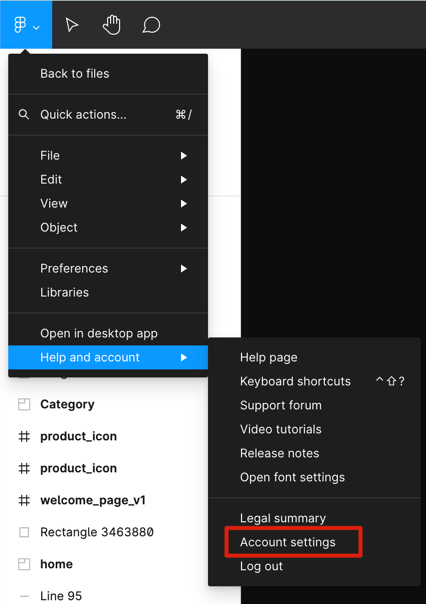
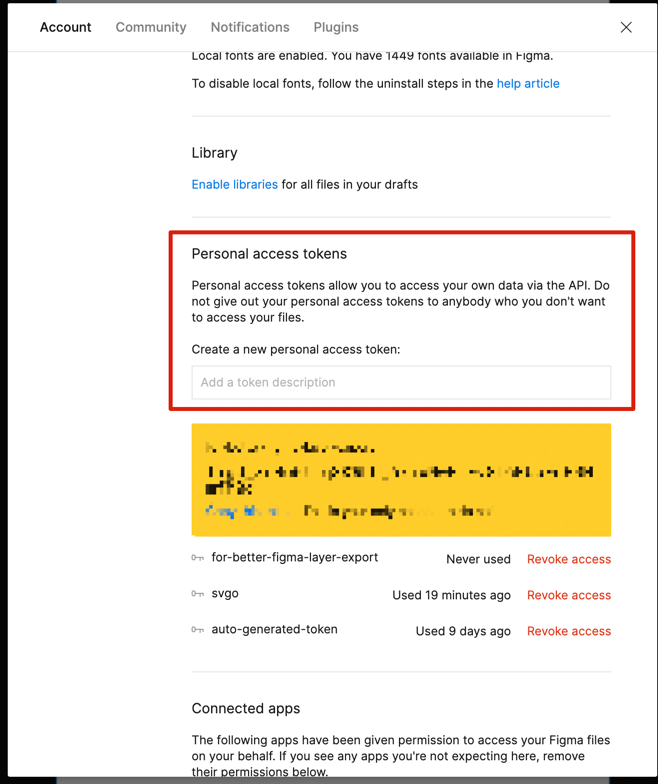
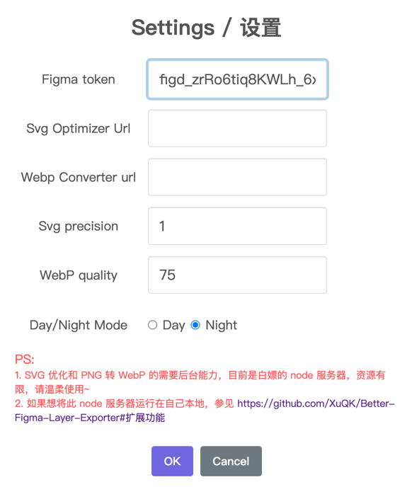

声明：本脚本仅在 Chrome 中测试通过，其它浏览器请自行测试。

# 脚本说明

帮助广大使用 figma 的 Android 开发者摆脱繁琐的不同 dpi 图片导入过程，实现一键将 figma 中的图层按照不同的 dpi 直接导入到对应的 drawable-*dpi 文件夹。

至于用 figma 下载不同 dpi 图片，然后导入到 AndroidStudio 中，然后改名，这套流程有多折磨人，只能说，懂的都懂，我就不多说了。

# 脚本功能

在 Figma 的 Export 处增加三个按钮：

## 导出 PNG 到指定 res 目录

导出的 png 根据所选文件夹下的 drawable 文件夹 dpi 情况，自动导出对应的 dpi 图片，并保存到对应目录。

举个例子，我们选定两个图层后，直接点击"导出 PNG 到指定 res 目录"

由于此目录下仅有`xhdpi`和`hdpi`两个文件夹，因此脚本会去下载选定图层对应 dpi 的 png 图片，一共 4 张，然后自动下载到对应 dpi 目录下

> 每次导出的文件夹会自动记录，记录的 key 为"figma 项目" + "哪个导出按钮"，也是个相当方便的功能，不需要每次导出都要一层层的去选目录了~。

## 经 SVGO 优化并导出

> 需要后台配合，详见下文"扩展功能"

导出的 svg，经过 svgo 优化再存储，为何建议经优化再使用，主要还是性能问题（咱也没测试，官方说有好处那就当有好处了~）

以下是未优化和优化过后再导入 AndroidStudio 的对比：

左边是直接从 figma 导出未优化过的，右边是优化过的。

可以看出来，最明显的就是 AndroidStudio 关于性能的提示没有了，path 字符数从 1560 减少到了 692，可以说是效果相当显著了。

## 导出 WebP 到指定 res 目录

与"导出 PNG 到指定 res 目录"功能一致，只是多了一步将 PNG 转换成 WebP。

# 使用说明

## 安装

1. 首先需要插件 Tampermonkey 或 ScriptCat 之类的脚本管理插件，如果未安装，自行到 Chrome 插件商店搜索安装即可
2. 然后打开 GreasyFork，搜索脚本"Better Figma Layer Exporter"

## 使用

### 获取 FigmaToken

打开账户设置

直接拉到最下面，在这里填入一个名称，比如"for-better-figma-layer-exporter"然后回车，复制生成的 token。

### 配置脚本参数

首先要打开一个 Figma 页面，然后可以在 Tampermonkey 处看到对应脚本，打开设置

在弹出来的弹窗中，填入必要的信息，其中，FigmaToken 是必须的：

> 注意，此处由于 Figma 本身的快捷键冲突，导致粘贴失效，这里可以将刚才生成的 figma token 直接复制到网址栏，然后全选，直接将其拖动到 token 设置栏即可（当然硬要手打也是可以的~）。

然后随便选中一个图层，点开 Export 栏目，用"脚本功能"中描述的三个按钮操作即可。

### 扩展功能

此时，只有第二个"导出 png 到指定 res 目录"是可用的。

因为通过 svgo 优化 svg，和直接将 PNG 转换为 WebP 输出，需要后台能力配合。

因为需要运行一个 node 后台，所以首先需要安装 node: https://nodejs.org/zh-cn 。

将此项目：[Android Tool Server](https://github.com/XuQK/Android-Tool-Server) clone 下来后，切换到目录下，直接运行`npm run start`。

然后在脚本的 Settings 的 Server host 中填入`http://127.0.0.1:6636`即可。

也可以将后台脚本部署在自己的服务器使用。
